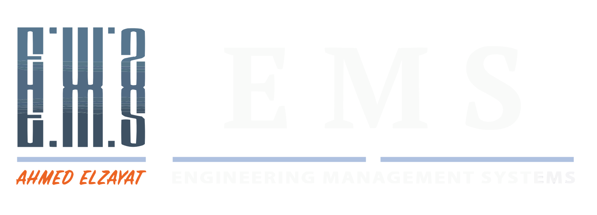

# CN-05 Tower | Energy & Management System (EMS)



CN-05 Tower is a next-generation Enterprise Management System (EMS) designed for modern skyscrapers. It combines a stunning **Glassmorphic UI** with advanced **Digital Twin** technology and **Predictive Maintenance** analytics to provide building operators with unparalleled control and insight.

## ✨ Key Features

- **Enterprise Dashboard**: A high-level overview of tower performance, occupancy, and energy consumption using live-updating circular gauges and line charts.
- **3D Digital Twin**: Interactive 60-floor visualization allowing operators to drill down into specific levels and monitor hardware nodes (HVAC, Fans, Cameras) in real-time.
- **Predictive Maintenance**: AI-driven health scores for critical building systems (Elevators, Pumps, Generators) with recommended maintenance tasks.
- **Smart Analytics**: Real-time energy monitoring and visual trends to optimize building efficiency.
- **Premium Aesthetics**: A custom "Enterprise OS" design language featuring high-blur glass effects, vibrant gradients, and specialized typography (Orbitron & Roboto).
- **Multi-Language Support**: Seamlessly switch between English and Arabic interfaces.

## 🛠 Tech Stack

- **Core**: [Expo SDK 54](https://expo.dev/) & [React Native](https://reactnative.dev/)
- **State Management**: [Zustand](https://github.com/pmndrs/zustand)
- **Styling**: Custom Theme System (Vanilla CSS-in-JS) with `expo-linear-gradient` and `expo-blur`.
- **Icons & Graphics**: `MaterialCommunityIcons` & `react-native-svg`.
- **Navigation**: `React Navigation` (Stack & Tabs).
- **Fonts**: Google Fonts (Orbitron, Roboto) via `expo-font`.

## 🚀 Getting Started

### Prerequisites

- Node.js (v18 or newer)
- npm or yarn
- Expo Go app (for mobile testing)

### Installation

1. **Clone the repository**:
   ```bash
   git clone https://github.com/hmahmoud2211/CN05-Tower-Mobile-App.git
   cd CN05-Tower-Mobile-App
   ```

2. **Install dependencies**:
   ```bash
   npm install
   ```

3. **Start the development server**:
   ```bash
   npx expo start
   ```

### Running the App

- **Web**: Press `w` in the terminal to open in your browser.
- **Android**: Press `a` or scan the QR code with the Expo Go app.
- **iOS**: Press `i` or scan the QR code with the Expo Go app.

## 🌐 Deployment

### Netlify (Web)
The project is pre-configured for Netlify deployment.
- **Build Command**: `npm run build`
- **Publish Directory**: `dist`
- **Routing**: SPA routing is handled via `netlify.toml`.

### Mobile (EAS)
To build a standalone APK or IPA:
```bash
eas build --platform android
eas build --platform ios
```

## 📂 Project Structure

```text
src/
├── components/        # Reusable UI & Layout components
│   ├── layout/        # AppHeader, Screen Wrappers
│   ├── ui/            # GlassCard, Typography, Floating Buttons
│   └── gauges/        # Circular Progress & Metrics
├── data/              # Mock Data & Constants
├── navigation/        # Stack & Tab Navigators
├── screens/           # Main Screen implementations
├── store/             # Zustand state management
└── theme/             # Colors, Spacing, and Global Styles
```

## 📜 License

This project is proprietary and confidential. All rights reserved.

---
*Built with ❤️ for the future of Smart Building Management.*
